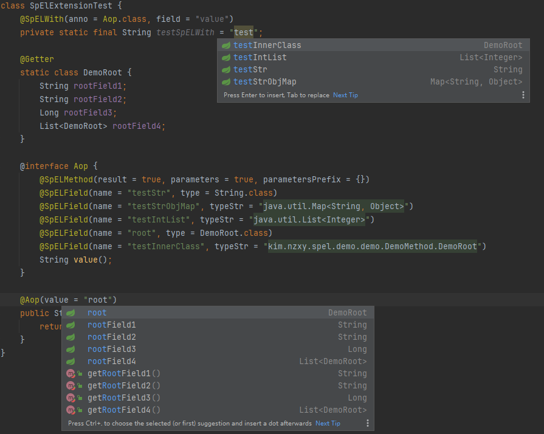

# SpEL Extension

A set of Java annotations which can be used in JVM-based languages. They serve as an additional documentation and can be
interpreted by IDEs and static analysis tools to improve code analysis.

`annotations` artifact requires JDK 1.8 or higher. 

## Using the annotations

The annotations are published on [Maven Central](https://repo1.maven.org/maven2/kim/nzxy/spel-extension/). To add a dependency using gradle write the following in the `build.gradle` file (Groovy DSL)

```groovy
dependencies {
    compileOnly 'kim.nzxy:spel-extension:1.0.0'
}
```

or in the `build.gradle.kts` file (Kotlin DSL)

```kotlin
dependencies {
    compileOnly("kim.nzxy:spel-extension:1.0.0")
}
```

To add a dependency using Maven, write the following in `pom.xml`:

```xml
<dependency>
    <groupId>kim.nzxy</groupId>
    <artifactId>spel-extension</artifactId>
    <version>1.0.0</version>
    <scope>provided</scope>
</dependency>
```

Then add plugin [SpEL Extension](https://github.com/ly-chn/spel-extension-idea)
## Example

